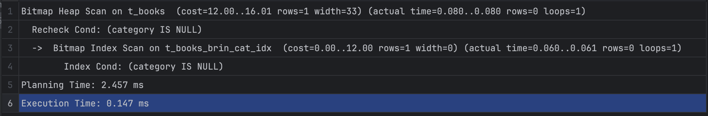
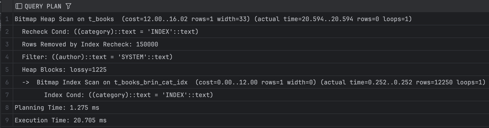
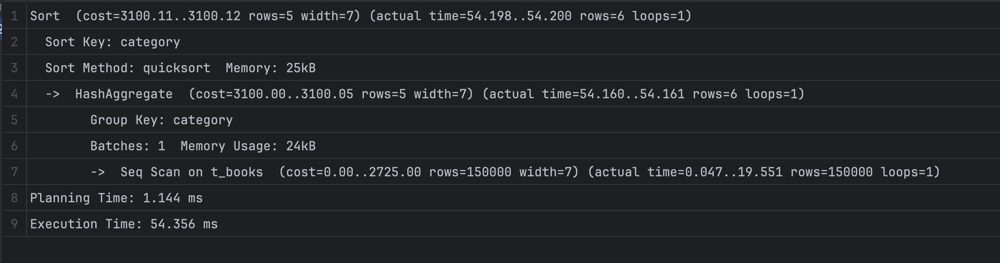
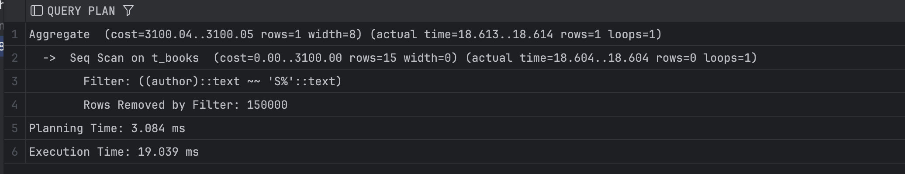
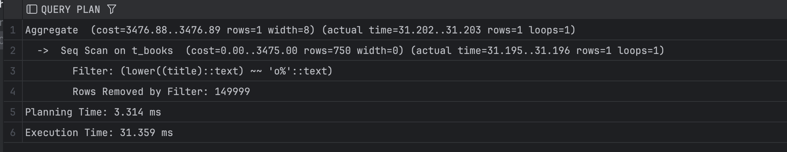

# Задание 1: BRIN индексы и bitmap-сканирование

1. Удалите старую базу данных, если есть:
   ```shell
   docker compose down
   ```

2. Поднимите базу данных из src/docker-compose.yml:
   ```shell
   docker compose down && docker compose up -d
   ```

3. Обновите статистику:
   ```sql
   ANALYZE t_books;
   ```

4. Создайте BRIN индекс по колонке category:
   ```sql
   CREATE INDEX t_books_brin_cat_idx ON t_books USING brin(category);
   ```

5. Найдите книги с NULL значением category:
   ```sql
   EXPLAIN ANALYZE
   SELECT * FROM t_books WHERE category IS NULL;
   ```
   
   *План выполнения:*
   
   
   *Объясните результат:*
   План показывает, что PostgreSQL использует BRIN-индекс для быстрого нахождения диапазонов страниц, где могли быть ```NULL```, а затем проверяет строки через Bitmap Heap Scan. Фактически строк с category ```IS NULL``` не найдено, поэтому запрос выполняется очень быстро (0.147 мс).

6. Создайте BRIN индекс по автору:
   ```sql
   CREATE INDEX t_books_brin_author_idx ON t_books USING brin(author);
   ```

7. Выполните поиск по категории и автору:
   ```sql
   EXPLAIN ANALYZE
   SELECT * FROM t_books 
   WHERE category = 'INDEX' AND author = 'SYSTEM';
   ```
   
   *План выполнения:*
   
   
   *Объясните результат (обратите внимание на bitmap scan):*
   План показывает, что PostgreSQL использует BRIN-индекс только по `category`, который даёт много «ложных» кандидатов (lossy-блоки), поэтому все 150 000 строк приходится перепроверять в heap; условие по `author` применяется уже как обычный фильтр.
   BRIN-индекс по `author` не помогает, потому что значения автора распределены случайно и плохо коррелируют с физическим порядком строк, из-за чего запрос получается медленным (20,705 мс).


8. Получите список уникальных категорий:
   ```sql
   EXPLAIN ANALYZE
   SELECT DISTINCT category 
   FROM t_books 
   ORDER BY category;
   ```
   
   *План выполнения:*
   
   
   *Объясните результат:*
   Запрос выполняет полное последовательное сканирование таблицы `t_books`, потому что агрегирование `GROUP BY category` требует просмотра всех 150 000 строк. Далее PostgreSQL делает HashAggregate для подсчёта групп и отдельную `Sort` по `category`; индексы здесь не используются, так как нужно обработать всю таблицу целиком (итог 54,356 мс).


9. Подсчитайте книги, где автор начинается на 'S':
   ```sql
   EXPLAIN ANALYZE
   SELECT COUNT(*) 
   FROM t_books 
   WHERE author LIKE 'S%';
   ```
   
   *План выполнения:*
   
   
   *Объясните результат:*
   PostgreSQL выполняет Seq Scan, потому что условие `author LIKE 'S%'` без подходящего btree-индекса не может быть эффективно ускорено и требует проверки всех 150 000 строк. В результате все строки отфильтровываются, а агрегат `COUNT(*)` считается уже после полного прохода по таблице (19 мс).


10. Создайте индекс для регистронезависимого поиска:
    ```sql
    CREATE INDEX t_books_lower_title_idx ON t_books(LOWER(title));
    ```

11. Подсчитайте книги, начинающиеся на 'O':
    ```sql
    EXPLAIN ANALYZE
    SELECT COUNT(*) 
    FROM t_books 
    WHERE LOWER(title) LIKE 'o%';
    ```
   
   *План выполнения:*
   
   
   *Объясните результат:*
   Несмотря на функциональный индекс `LOWER(title)`, PostgreSQL выбирает Seq Scan, потому что условие `LIKE 'o%'` по текущей статистике считается низкоселективным и выгоднее проверить всю таблицу целиком.В итоге все 150 000 строк просматриваются, почти все отбрасываются фильтром, и `COUNT(*)` считается после полного сканирования (31,359 мс).


12. Удалите созданные индексы:
    ```sql
    DROP INDEX t_books_brin_cat_idx;
    DROP INDEX t_books_brin_author_idx;
    DROP INDEX t_books_lower_title_idx;
    ```

13. Создайте составной BRIN индекс:
    ```sql
    CREATE INDEX t_books_brin_cat_auth_idx ON t_books 
    USING brin(category, author);
    ```

14. Повторите запрос из шага 7:
    ```sql
    EXPLAIN ANALYZE
    SELECT * FROM t_books 
    WHERE category = 'INDEX' AND author = 'SYSTEM';
    ```
   
   *План выполнения:*
   
   
   *Объясните результат:*
   Составной BRIN-индекс по `(category, author)` позволяет сразу отфильтровать блоки, где оба условия могут выполняться, поэтому резко уменьшается число lossy-блоков и перепроверок в heap.В результате запрос выполняется значительно быстрее (примерно 2 мс против 20 мс раньше), хотя из-за природы BRIN всё равно требуется recheck условий.
