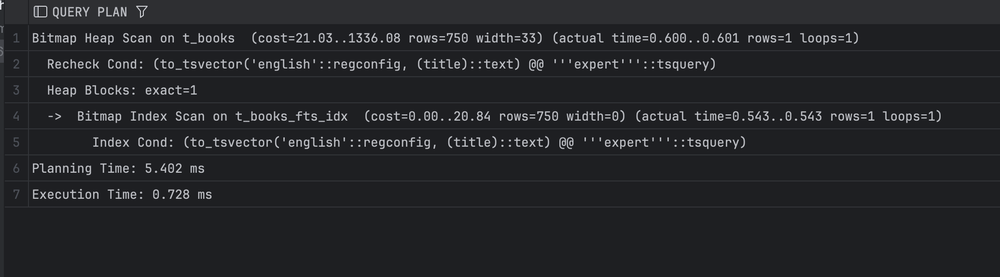
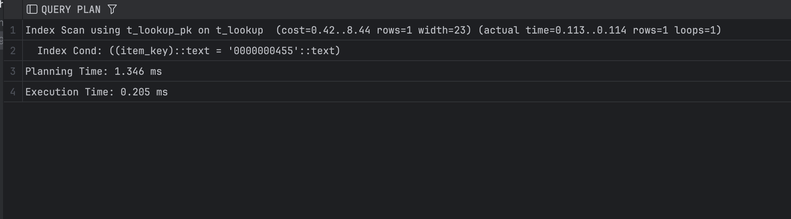
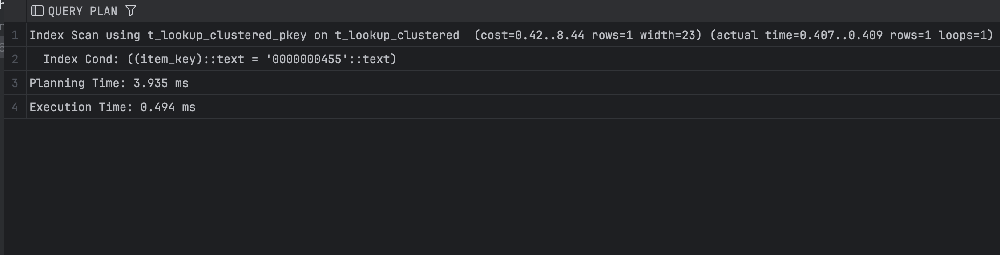
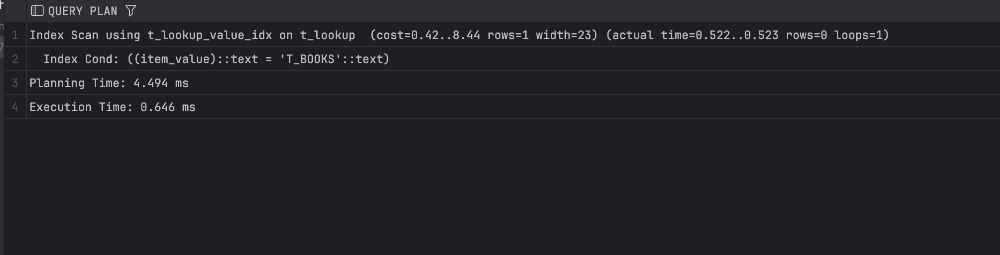
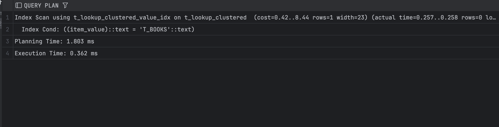

## Задание 2

1. Удалите старую базу данных, если есть:
    ```shell
    docker compose down
    ```

2. Поднимите базу данных из src/docker-compose.yml:
    ```shell
    docker compose down && docker compose up -d
    ```

3. Обновите статистику:
    ```sql
    ANALYZE t_books;
    ```

4. Создайте полнотекстовый индекс:
    ```sql
    CREATE INDEX t_books_fts_idx ON t_books 
    USING GIN (to_tsvector('english', title));
    ```

5. Найдите книги, содержащие слово 'expert':
    ```sql
    EXPLAIN ANALYZE
    SELECT * FROM t_books 
    WHERE to_tsvector('english', title) @@ to_tsquery('english', 'expert');
    ```
    
    *План выполнения:*
    
    
    *Объясните результат:*
    План показывает использование GIN-индекса полнотекстового поиска, который быстро находит строки с лексемой `expert` и передаёт их в Bitmap Heap Scan для точной проверки. Благодаря высокой селективности FTS-индекса читается всего один heap-блок, поэтому запрос выполняется очень быстро (0.728 мс).

6. Удалите индекс:
    ```sql
    DROP INDEX t_books_fts_idx;
    ```

7. Создайте таблицу lookup:
    ```sql
    CREATE TABLE t_lookup (
         item_key VARCHAR(10) NOT NULL,
         item_value VARCHAR(100)
    );
    ```

8. Добавьте первичный ключ:
    ```sql
    ALTER TABLE t_lookup 
    ADD CONSTRAINT t_lookup_pk PRIMARY KEY (item_key);
    ```

9. Заполните данными:
    ```sql
    INSERT INTO t_lookup 
    SELECT 
         LPAD(CAST(generate_series(1, 150000) AS TEXT), 10, '0'),
         'Value_' || generate_series(1, 150000);
    ```

10. Создайте кластеризованную таблицу:
     ```sql
     CREATE TABLE t_lookup_clustered (
          item_key VARCHAR(10) PRIMARY KEY,
          item_value VARCHAR(100)
     );
     ```

11. Заполните её теми же данными:
     ```sql
     INSERT INTO t_lookup_clustered 
     SELECT * FROM t_lookup;
     
     CLUSTER t_lookup_clustered USING t_lookup_clustered_pkey;
     ```

12. Обновите статистику:
     ```sql
     ANALYZE t_lookup;
     ANALYZE t_lookup_clustered;
     ```

13. Выполните поиск по ключу в обычной таблице:
     ```sql
     EXPLAIN ANALYZE
     SELECT * FROM t_lookup WHERE item_key = '0000000455';
     ```
     
     *План выполнения:*
     
     
     *Объясните результат:*
     План показывает Index Scan по первичному ключу, потому что `item_key` — PK с B-tree индексом, и поиск по равенству сразу находит нужную строку. Благодаря этому читается одна запись без полного сканирования, и запрос выполняется очень быстро (0.205 мс).


14. Выполните поиск по ключу в кластеризованной таблице:
     ```sql
     EXPLAIN ANALYZE
     SELECT * FROM t_lookup_clustered WHERE item_key = '0000000455';
     ```
     
     *План выполнения:*
     
     
     *Объясните результат:*
     Запрос также выполняется через Index Scan по первичному ключу, так как поиск по равенству всегда использует B-tree индекс. Кластеризация почти не влияет на одиночный lookup: физический порядок данных важен для диапазонных и последовательных чтений, поэтому время здесь сопоставимо (0.494 мс).


15. Создайте индекс по значению для обычной таблицы:
     ```sql
     CREATE INDEX t_lookup_value_idx ON t_lookup(item_value);
     ```

16. Создайте индекс по значению для кластеризованной таблицы:
     ```sql
     CREATE INDEX t_lookup_clustered_value_idx 
     ON t_lookup_clustered(item_value);
     ```

17. Выполните поиск по значению в обычной таблице:
     ```sql
     EXPLAIN ANALYZE
     SELECT * FROM t_lookup WHERE item_value = 'T_BOOKS';
     ```
     
     *План выполнения:*
     
     
     *Объясните результат:*
     Запрос использует B-tree индекс по `item_value` и выполняется как `Index Scan`, быстро проверяя равенство по значению без полного сканирования таблицы. Кластеризация здесь роли не играет, так как поиск идёт по неключевому столбцу и всё равно начинается с индекса (время 0.646 мс).


18. Выполните поиск по значению в кластеризованной таблице:
     ```sql
     EXPLAIN ANALYZE
     SELECT * FROM t_lookup_clustered WHERE item_value = 'T_BOOKS';
     ```
     
     *План выполнения:*
     
     
     *Объясните результат:*
     Запрос выполняется через Index Scan по индексу на `item_value` и быстро проверяет равенство, не делая полного сканирования таблицы. В кластеризованной таблице он работает немного быстрее (0.362 мс), потому что физическое расположение строк ближе к порядку индекса, но принципиальной разницы для точечного поиска нет.


19. Сравните производительность поиска по значению в обычной и кластеризованной таблицах:
     
     *Сравнение:*
     Поиск по значению в обеих таблицах использует B-tree индекс и выполняется быстро, но в кластеризованной таблице он немного быстрее (0.36 мс против 0.65 мс), так как строки с близкими значениями физически расположены рядом.
     В целом выигрыш небольшой, потому что для точечного поиска решающую роль играет индекс, а не порядок хранения данных.
