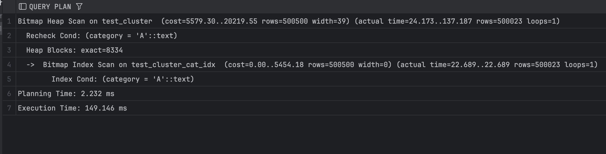
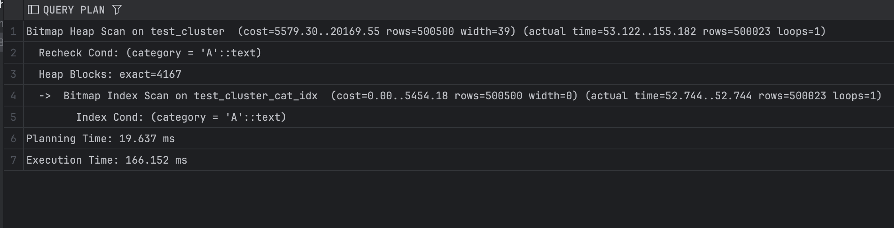

## Задание 3

1. Создайте таблицу с большим количеством данных:
    ```sql
    CREATE TABLE test_cluster AS 
    SELECT 
        generate_series(1,1000000) as id,
        CASE WHEN random() < 0.5 THEN 'A' ELSE 'B' END as category,
        md5(random()::text) as data;
    ```

2. Создайте индекс:
    ```sql
    CREATE INDEX test_cluster_cat_idx ON test_cluster(category);
    ```

3. Измерьте производительность до кластеризации:
    ```sql
    EXPLAIN ANALYZE
    SELECT * FROM test_cluster WHERE category = 'A';
    ```
    
    *План выполнения:*
    
    
    *Объясните результат:*
    До кластеризации PostgreSQL использует Bitmap Index Scan + Bitmap Heap Scan, но из-за равномерного распределения значений `category` по таблице ему приходится читать тысячи heap-блоков, где строки с `'A'` разбросаны физически. В результате, несмотря на наличие индекса, выбирается около 500 000 строк, чтение идёт по множеству страниц, и запрос получается сравнительно медленным (149.146 мс).


4. Выполните кластеризацию:
    ```sql
    CLUSTER test_cluster USING test_cluster_cat_idx;
    ```
    
    *Результат:*
    ```
    workshop.public> CLUSTER test_cluster USING test_cluster_cat_idx
    [2025-12-19 01:54:21] completed in 912 ms
    ```

5. Измерьте производительность после кластеризации:
    ```sql
    EXPLAIN ANALYZE
    SELECT * FROM test_cluster WHERE category = 'A';
    ```
    
    *План выполнения:*
    
    
    *Объясните результат:*
    После кластеризации строки с `category = 'A'` стали физически располагаться компактно, поэтому число читаемых heap-блоков сократилось примерно вдвое (с 8300 до 4200).Однако общее время почти не улучшилось (даже чуть выросло), потому что выборка всё ещё очень большая (500 000 строк), и основная стоимость — это чтение и возврат данных, а не поиск через индекс.


6. Сравните производительность до и после кластеризации:
    
    До кластеризации строки с `category = 'A'` были разбросаны по таблице, что приводило к чтению большого числа heap-страниц и времени выполнения 150 мс. После кластеризации данные стали компактнее и число читаемых страниц сократилось примерно вдвое, но из-за очень большого объёма возвращаемых строк общее время запроса почти не изменилось (160 мс), поэтому выигрыш оказался минимальным.
